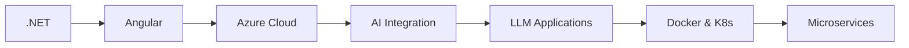

<div align="center">

# 👨‍💻 Jugal Lotwala

### Full-Stack Developer | ASP.NET Core • Angular • Cloud & AI Enthusiast

[](https://www.linkedin.com/in/jugal-lotwala-699745200/)
[](#)
[](mailto:jugallotwala@gmail.com)

</div>

---

## 🎯 About Me

```typescript
const jugal = {
    role: "Full-Stack Developer & AI Enthusiast",
    code: ["C#", "TypeScript", "JavaScript", "Python"],
    technologies: {
        backend: ["ASP.NET Core", "Web API", ".NET"],
        frontend: ["Angular", "Bootstrap", "TailwindCSS"],
        databases: ["SQL Server", "PostgreSQL", "MongoDB"],
        cloud: ["Azure", "Azure AI Services", "Azure OpenAI"],
        ai: ["OpenAI API", "Azure Cognitive Services", "Machine Learning"],
        tools: ["Docker", "Git", "Azure DevOps", "Postman"]
    },
    currentFocus: "Building intelligent, scalable cloud-native applications",
    learning: ["AI Integration", "LLM Applications", "Microservices", "DevOps Automation"]
};
```

## 🚀 What I'm Building

🔹 **Enterprise Web APIs** - Scalable RESTful services with ASP.NET Core  
🔹 **Modern SPAs** - Dynamic Angular applications with responsive UI/UX  
🔹 **AI-Powered Solutions** - Intelligent applications using Azure AI and OpenAI  
🔹 **Cloud Solutions** - Azure-powered applications with AI capabilities  
🔹 **DevOps Pipelines** - Automated CI/CD workflows for seamless deployment

## 💡 Current Learning Journey



## 🛠️ Technology Arsenal

<div align="center">

### Backend Development


### Frontend Development


### AI & Machine Learning


### Databases


### Cloud & DevOps


### Tools & IDEs


</div>

## 🤖 AI & Innovation

```python
class AIExplorer:
    def __init__(self):
        self.interests = [
            "Large Language Models (LLMs)",
            "Conversational AI & Chatbots",
            "Azure OpenAI Services",
            "Intelligent Document Processing",
            "AI-Powered Search & Recommendations",
            "Natural Language Processing (NLP)"
        ]
    
    def build_intelligent_apps(self):
        return "Integrating AI to solve real-world problems"
```

### 🧠 AI Projects & Experiments

🤖 **AI-Powered Chatbot** - Intelligent customer service assistant using Azure OpenAI  
📄 **Document Intelligence** - Automated document analysis with Azure Cognitive Services  
🔍 **Smart Search Engine** - Semantic search with vector embeddings and AI  
💬 **Content Generator** - AI-driven content creation tool using GPT models  
📊 **Data Analytics AI** - Predictive analytics with machine learning models

## 🎯 Goals & Vision

- ✅ Master modern full-stack development
- ✅ Build AI-powered production applications
- 🔄 Integrate LLMs into enterprise solutions
- 🔄 Contribute to open-source AI projects
- 🔄 Obtain Azure AI certifications
- 🔄 Launch AI-driven SaaS product

## 💼 Professional Highlights

```yaml
experience:
  - Full-Stack Development with modern frameworks
  - AI Integration with OpenAI and Azure AI Services
  - RESTful API design and implementation
  - Cloud-native application architecture
  - Database design and optimization
  - CI/CD pipeline automation
  
philosophy: |
  "Clean code, scalable architecture, AI innovation, and continuous learning 
   are the pillars of next-generation software development."
```

## 📚 AI & Tech Resources I Follow

- 🎓 Azure AI Documentation & Best Practices
- 🧠 OpenAI Research & API Updates
- 🚀 .NET & Angular Community Blogs
- 💡 Machine Learning & NLP Papers
- 🔧 Cloud Architecture Patterns

## 🤝 Let's Connect!

<div align="center">

I'm always open to interesting conversations and collaboration opportunities, especially in AI and cloud technologies!

[](https://www.linkedin.com/in/jugal-lotwala-699745200/)
[](https://github.com/jugal1512)

### 💬 "Building intelligent solutions, one commit at a time"

</div>

---

<div align="center">


⭐️ From [Jugal Lotwala](https://github.com/YourGitHubUsername)

</div>
